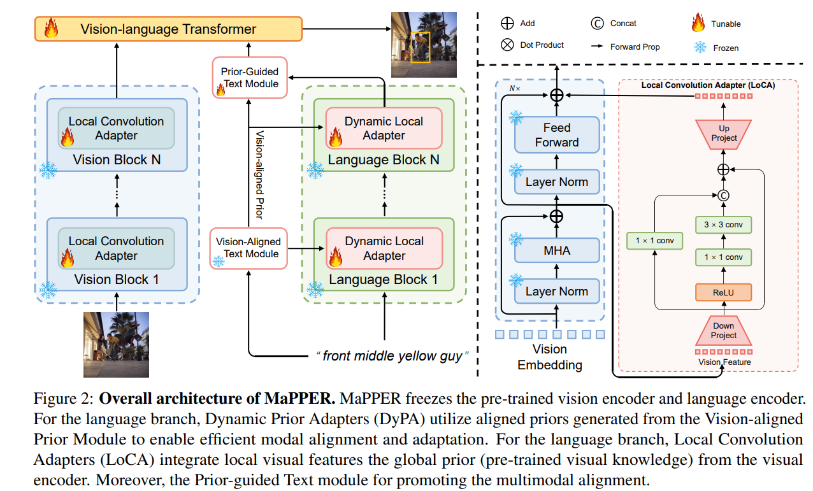

<div align=center>
  
# MaPPER: Multimodal Prior-guided Parameter Efficient Tuning for Referring Expression Comprehension
This is the official implementation of [**MaPPER: Multimodal Prior-guided Parameter Efficient Tuning for Referring Expression Comprehension**](https://aclanthology.org/2024.emnlp-main.287). This paper has been accepted by EMNLP Main 2024.


<p>
<a href='https://arxiv.org/abs/2409.13609'></a>
<a href='https://aclanthology.org/2024.emnlp-main.287'></a>
</p>

</div>

## :sparkles: Overview
<p align="center">  </p>

In this paper, we perform an in-depth exploration of parameterefficient transfer learning (PETL) methods for REC tasks. We introduce **MaPPER** aimed at improving both the effectiveness and efficiency of visual-text alignment, as well as enhancing visual perception by incorporating local visual semantics. We propose the novel Dynamic Prior Adapter
(DyPA) and Local Convolution Adapter (LoCA). The former employs aligned prior to dynamically
adjust the language encoder, while the latter introduces local visual features for enhancing the visual encoder. Extensive experiments demonstrate that our method can outperform the state-of-the-art (SOTA) methods in REC tasks, with only **1.41%** tunable parameters within pre-trained backbones


### :point_right: Installation
1.  Clone this repository.
    ```
    git clone https://github.com/liuting20/MaPPER.git
    ```

2.  Prepare for the running environment. 

    ```
     conda env create -f environment.yaml      
     pip install -r requirements.txt
    ```

### :point_right: Getting Started

Please refer to [GETTING_STARGTED.md](GETTING_STARTED.md) to learn how to prepare the datasets and pretrained checkpoints.

### Model Zoo

The models are available in [[Gdrive]](https://drive.google.com/drive/folders/1fnD2DlPikdEwZPdw3Aq5ctGZnDQx2FMU?usp=sharing)

<table border="2">
    <thead>
        <tr>
            <th colspan=3> &nbsp&nbsp&nbsp&nbsp&nbsp&nbsp&nbsp RefCOCO </th>
            <th colspan=3> &nbsp&nbsp&nbsp&nbsp&nbsp&nbsp&nbsp RefCOCO+</th>
            <th colspan=3> &nbsp&nbsp&nbsp&nbsp&nbsp&nbsp&nbsp RefCOCOg</th>
        </tr>
    </thead>
    <tbody>
    <tr>    
            <td>val</td>
            <td>testA</td>
            <td>testB</td>
            <td>val</td>
            <td>testA</td>
            <td>testB</td>
            <td>g-val</td>
            <td>u-val</td>
            <td>u-test</td>
        </tr>
    </tbody>
    <tbody>
    <tr>
            <td>86.03</td>
            <td>88.90</td>
            <td>81.19</td>
            <td>74.92</td>
            <td>81.12</td>
            <td>65.68</td>
            <td>74.60</td>
            <td>76.32</td>
            <td>75.81</td>
        </tr>
    </tbody>
    <tbody>
    <tr>   
    </tbody>
</table>


### :point_right: Training and Evaluation

1.  Training
    ```
    bash train.sh
    ```
    or
    ```
    sbatch run.sh (if you have multiple nodes)
    ```
    

    We recommend to set --max_query_len 40 for RefCOCOg, and --max_query_len 20 for other datasets. We recommend to set --epochs 180 (--lr_drop 120 acoordingly) for RefCOCO+, and --epochs 90 (--lr_drop 60 acoordingly) for other datasets.
    

2.  Evaluation
    ```
    bash test.sh
    ```

### :thumbsup: Acknowledge
This codebase is partially based on [TransVG](https://github.com/djiajunustc/TransVG) and [DARA](https://github.com/liuting20/DARA).


## :pushpin: Citation
Please consider citing our paper in your publications, if our findings help your research.
```bibtex
@inproceedings{liu2024mapper,
  title={MaPPER: Multimodal Prior-guided Parameter Efficient Tuning for Referring Expression Comprehension},
  author={Liu, Ting and Xu, Zunnan and Hu, Yue and Shi, Liangtao and Wang, Zhiqiang and Yin, Quanjun},
  booktitle={Proceedings of the 2024 Conference on Empirical Methods in Natural Language Processing},
  pages={4984--4994},
  year={2024}
}

```

## :e-mail: Contact
For any question about our paper or code, please contact [Ting Liu](mailto:liuting20@nudt.edu.cn).